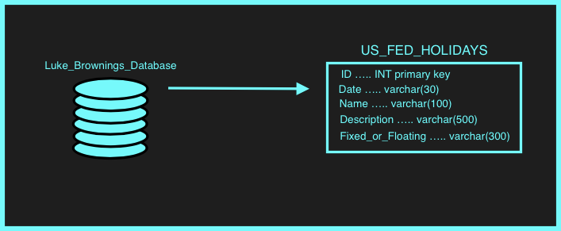

# FED_HOLIDAYS_API
Simple API built in C# that returns information on US Federal Holidays given dates from 2021-2023.

## Instructions to Build and Run Project
1. If not already installed, download and install your preferred API Platform ([Postman](https://www.postman.com/downloads/) recommended)
2. If not already installed, download and install your preferred C# IDE ([JetBrains Rider](https://www.jetbrains.com/rider/download/#section=mac) or [Microsoft Visual Studio](https://visualstudio.microsoft.com/downloads/) recommended)
3. Clone the [FED_HOLIDAYS_API](https://github.com/luk19/FED_HOLIDAYS_API) Repository to your installed C# IDE
4. Open the Holiday_API solution and Holiday_API project folder
5. If not already installed, install the "System.Data.SQLite" package on your C# IDE --> (right click on the "Holiday_API" C# project folder, click "Manage NuGet Packages", search for "System.Data.SQLite", click the appropriate package and add it to the project)
6. With the Holiday_API project open in your C# IDE, open "Program.cs"
7. Run "Program.cs" (In Rider --> Click the "Run" button near the top right corner of the application) and (In Visual Studio --> click the "Run" symbol near the top left corner of the application)
8. In the output/console, the script should print the url and port number that this app is "listening" on, example: Now listening on: https://localhost:5001
9. Copy the listening url and paste it into a browser or in a postman get request and hit Send/Enter. This should return the text "Hello Federal Holidays API User..."
10. Using the same url as above add the endpoint "/isHoliday/{iso-formatted-date}" to the url. Example: https://localhost:5001/isHoliday/2021-01-01 14:05:00:123

## API Endpoints that can be Called
- /
- /isHoliday

## External Libraries Used
- System.Data.SQLite   -->   version # 1.0.116

## SQLite Database Schema

## Assumptions Made
- I assumed the accepted date could be simply added at the end of the url request (https://localhost:9999/endpoint/date) rather than submitted as a parameter.
- I assumed it was okay for the user/evaluator of this project to use an IDE to build and run the project rather than building and running it on a server or command line interface.

# Feedback

## General Notes
Overall, I'm extremely happy with the outcome of this project. When I read the first sentence of the Assignment description "Build a simple API, preferably in C#",
I was a bit overwhelmed because I had never built an API and I had never coded a single line of C# before. It was challenging in many ways and I was seriously ecstatic
that I was able to dive in and complete this project. My lack of C# experience is likely evident in the code, which I think is okay because I had fun, learned a lot,
and understand I have a lot more to learn.

## Time Spent
- 19 hours

## Problems/Issues
I don't think at any point during this project I ran into a "Wall" that I could not break through, but below is a list of obstacles that I think I spent extra time figuring out:
- SQL Data --> Iterating through and visualizing (printing) the data from the SQLite database in C# was the first challenge I faced. I would consider myself advanced at this in Python, but it took some time to figure out the syntax in C#, and I still don't think I executed it in the cleanest way, but it works.
- Unit Tests --> Before this project, I must admit that I had never written a unit test before. Figuring out the proper connections and project calls to perform the unit tests (like "calling a static method in non-static context") definitely took some time. Conceptually, I understand unit tests, but I would love to learn more about their purpose and how to build unit tests that make your code stronger. At the end of the day, building these unit tests forced me to think about different scenarios and write logic to deal with those scenarios, which I thought was pretty cool.

## Enhancements (if I had the time)
- Adding user authentication logic with an API token
- Adding an input option and endpoint for a date range rather than a specific date that would return all holidays in a specified date range.
- Day-ahead Alert --> setup a cron task that runs once a day, queries the database, and sends users an alert message if the next day is a Holiday.
- Easter Egg Dates --> if a user entered a date from 2021-2023 that has already passed and was _not_ a holiday, return the required "isHoliday: false" but also add an interesting fact from that date like "FactFromDate: Florida Man gets head-butted by Alligator."

